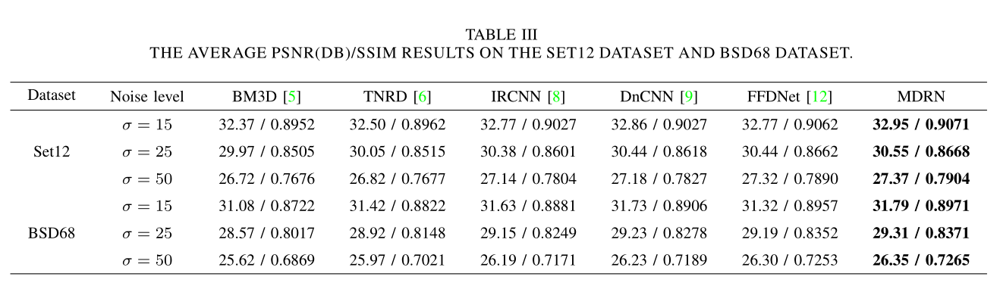

## A Multi-scale Dilated Residual Convolution Network for Image Denoising

## Abstract

## Image denoising for Gaussian Noise

### Results on Gray-scale Image Denoising

### Results on Color Image Denoising

## Image denoising for Real-world Noise

### Results on DND dataset

### Results on SIDD dataset
